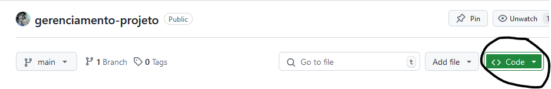
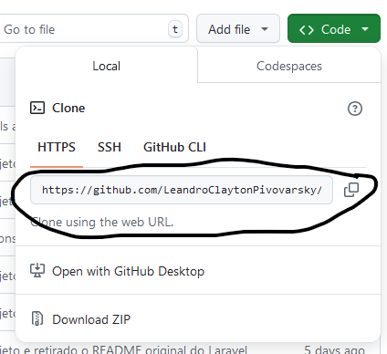

Código em desenvolvimento com objetivo de gerar um aplicativo capaz de gerenciar projetos.


<h3>O que é necessário para que o projeto funcione:</h3>

- <a href="https://getcomposer.org/download/">Composer</a>
- <a href="https://sourceforge.net/projects/xampp/files/">Xampp(com PHP 8.2) para Windows</a>
- <a href = "https://ubuntu.com/server/docs/how-to-install-and-configure-php"> PHP(Ubuntu apenas)</a>
<p>(O Laravel será instalado através do Composer)</p>

<br/>

<h3>Como puxar o projeto para o seu computador</h3>

- Na página online do projeto, clique no botão "<>Code":
<p align = center></p>

- Quando abrir a tela abaixo, copie através do botão direito do demarcado, ou copie o endereço que ali está presente :
<div align = center></div>

- Execute git clone no seu terminal e dentro da pasta que deseja

```
git clone https://github.com/LeandroClaytonPivovarsky/gerenciamento-projeto.
```

- Depois, através de sua IDE, selecione a pasta do projeto e prossiga.

- _Caso esteja usando Visual Studio Code, <a href="./thingsForReadme/VSCodeTutorial.md">clique aqui</a> para saber como proceder._


<h3>Como fazer o projeto rodar</h3>


Depois de clonado, faça o passo a passo abaixo:

1. No terminal, dentro da pasta do projeto, digite:


```
$ composer install
```

2. Crie uma cópia do .env.example, configure a porta e <a>crie um database local</a>, depois de criado, coloque no campo DB_DATABASE o nome dele.

3. Crie uma chave para o projeto no terminal e dentro da pasta do projeto através do comando:

```
$ php artisan key:generate
```

Após feitas as configurações acima, teste para ver se o banco de dados foi configurado corretamente no .env através das migrations:

Digite no terminal:

```
$ php artisan migrate:fresh -seed
```

Se tudo ocorrer bem e nenhum erro aparecer na tela, rode o código  através do:

```
$ php artisan serve
```
Boa codificação!! :)

<h3>Caso queira saber como o projeto está estruturado leia:</h3>

- <a>Estruturação do Banco de Dados</a>
- <a>Como estão organizadas as pastas(front-end)</a>
- <a>Como estão organizadas as pastas(back-end)</a>

