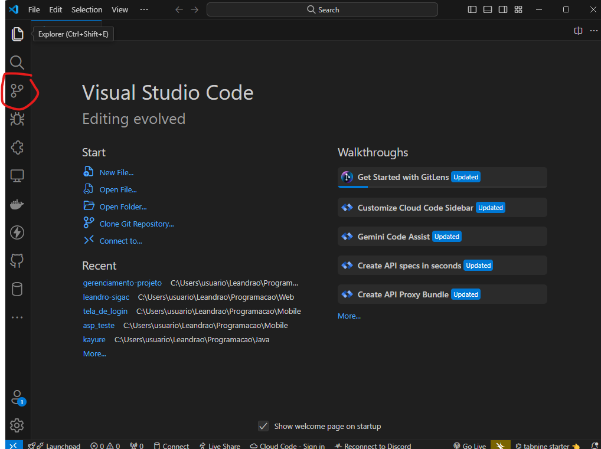
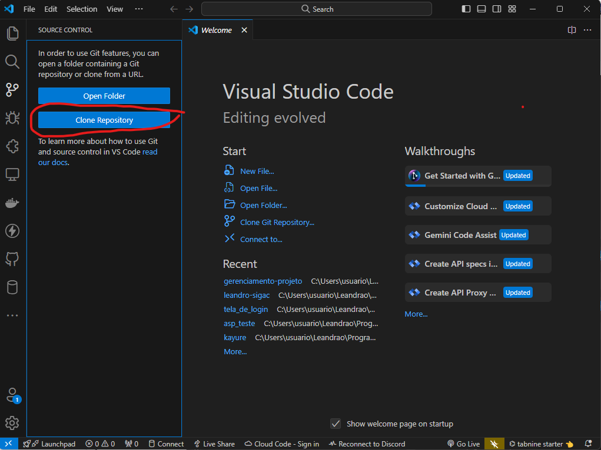
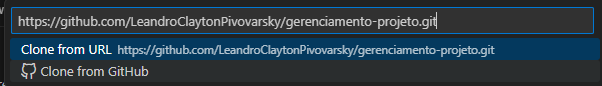

<h2>Como clonar o projeto a partir do VSCode(Visual Studio Code)</h2>

- <h4>Clique no botão conforme mostra a imagem:</h4>

    

- <h4>Depois, clique em Clonar Repositório:</h4>

    

- <h4>Cole aqui o link do repositório:</h4>

    

Após ter selecionado o "Clone from URL", ele irá pedir o local para onde clonar o arquivo. Escolha-o e abra a pasta com o VSCode.